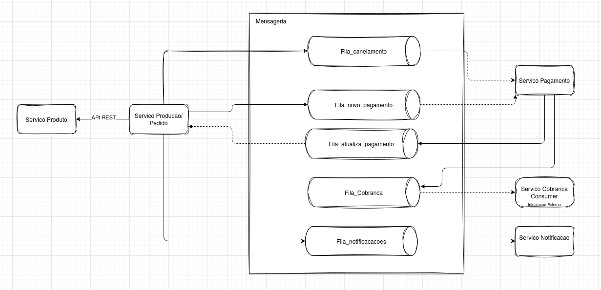
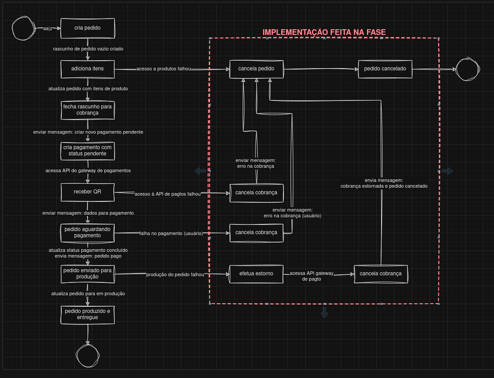
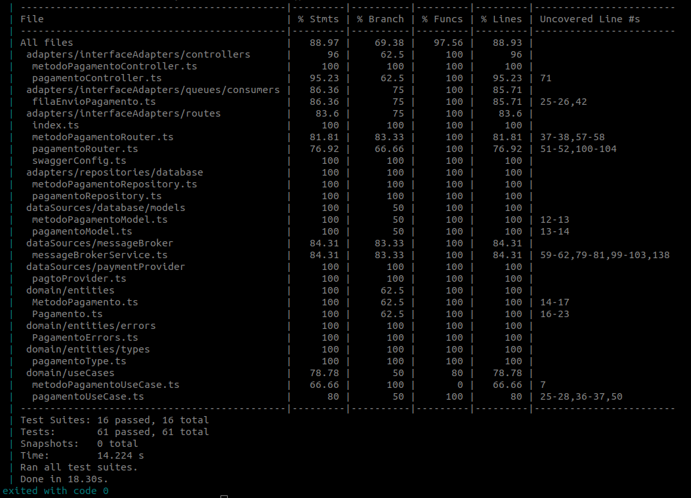
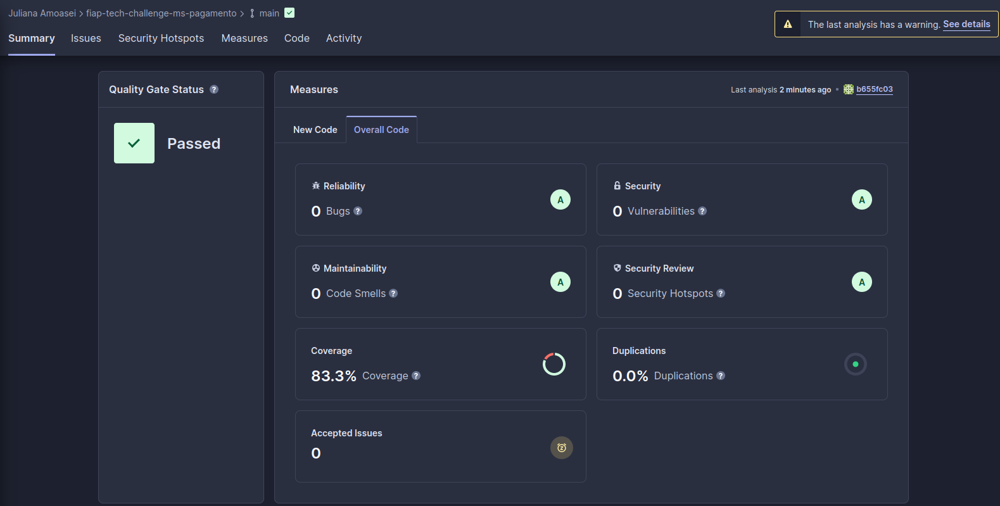
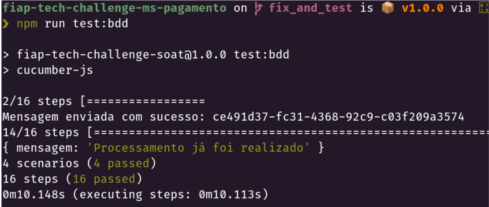

# Tech Challenge - Pós-Tech SOAT - FIAP - Microservico Pagamento

Este é o projeto desenvolvido durante a fase 5 do curso de pós-graduação em arquitetura de software da FIAP - turma II/2023.

Membros do grupo 30:
Diórgenes Eugênio da Silveira - RM 349116
Elton de Andrade Rodrigues - RM 349353
Gabriel Mendes - RM 348989
Juliana Amoasei dos Reis - RM 348666

## Repositórios

- [Infraestrutura](https://github.com/diorgeneseugenio/fiap-tech-challenge-soat-terraform)
- [Producao](https://github.com/EltonARodrigues/fiap-tech-challenge-soat-producao)
- [Produto](https://github.com/gabrielmendessilva/fiap-tech-challenge-soat-ms-produto)
- [Pagamento](https://github.com/JulianaAmoasei/fiap-tech-challenge-ms-pagamento/tree/main)
- [Autorizacao](https://github.com/JulianaAmoasei/fiap-auth-service-cognito)

### Changelog Fase V:

- **SAGA Coreografada**: Ajustado o projeto para seguir o padrao SAGA do tipo coreografado em todos os Microservicos;
- **LGPD Remocao**: Adicionado API para requisitar a exclusao dos dados pessoais;
- **LGPD Relatorio de impacto**: Adicionado API para relatorio de impacto dos dados pessoais;
- **Refatoração do sistema de infraestrutura** Atualizacoes no deploy AWS e execucao no eks para testes locais;

## Propósito do projeto

Fornecer um sistema para gerenciamento de pedidos para uma empresa do ramo de serviços de alimentação.

## SAGA Coreografia

Durante a fase 4 do projeto a separacao do monolito em microservicos seguiu o principio de desacoplamento, permitindo a melhor divisao das tarefas entre os integrantes. Ao avaliar a utilizacao de um orquestrador como SAGA observamos que essa decisão implicaria em um extenso trabalho de refatoração nos microsserviços existentes, mesmo que eles já estejam desacoplados.

### Vantagens Coreografia
Algumas vantagens da Coreografia lenvando em contexto a evolucao e desenvolvimento do nosso projeto durante as fases:

- **Implementação rápida:** A coreografia é mais rápida de implementar, especialmente com um número reduzido de microsserviços e da forma que a separacao seguiu na fase 4.
- **Simplicidade:** Não há necessidade de criar um novo serviço de orquestração, simplificando a arquitetura.
- **Menos etapas:** O fluxo de comunicação é mais direto, envolvendo apenas o microsserviço de pedido/pagamento e a etapa de pagamento.

### Revisão e Criação de Filas:

Para implementar a coreografia, as filas foram revisadas e criadas utilizando o AWS SQS como sistema de mensageria. O processamento das transações internas dos microsserviços também foi revisado e corrigido para evitar que falhas de processamento afetem o fluxo do pedido.

### Resultado:

A coreografia parece ser a opção mais adequada para a fase 5 devido à sua simplicidade, rapidez de implementação e menor quantidade de etapas a serem gerenciadas. 

Estrutura da SAGA Coreografada no projeto:


Distribuicao dos microservicos:


Fluxo da realizacao de um pedido:



### Relatórios OWASP ZAP
Disponibilizado em formato html:
-  [Relatório Inicial](docs/owasp/producao_antes.html)
-  [Relatório Corrigido](docs/owasp/producao_depois.html)

## Stack utilizada

- Node.js v20
- TypeScript
- DynamoDB
- Express
- Mongoose
- Docker
- AWS
  - DocumentDB
  - RDS
  - ECS
  - ECR
  - SQS
  - API GATEWAY
  - LOAD BALANCE


## DEPLOY
### Deploy AWS

O projeto é baseado na infraestrutura da AWS, o que requer o provisionamento de recursos e a configuração do deploy. As etapas incluem:

Utilização do repositório de [infraestrutura](https://github.com/diorgeneseugenio/fiap-tech-challenge-soat-terraform) para realizar o deploy do Terraform na AWS.

Após o provisionamento, é necessário configurar os secrets no github Action de cada repositório de microserviço. Isso permite que a cada merge na branch main seja realizado o build, push da imagem no RDS e deploy no ECS. Os procedimentos devem ser executados nos seguintes repositórios:
- [Producao](https://github.com/EltonARodrigues/fiap-tech-challenge-soat-producao)
- [Produto](https://github.com/gabrielmendessilva/fiap-tech-challenge-soat-ms-produto)
- [Pagamento](https://github.com/JulianaAmoasei/fiap-tech-challenge-ms-pagamento/tree/main)
- [Autorizacao](https://github.com/JulianaAmoasei/fiap-auth-service-cognito)

Por fim, dentro do API Gateway criado pelo Terraform, é necessário adicionar a autorização lambda nos endpoints dos microserviços.

### EKS Local
Para o deploy local utilize o repositorio de infra seguindo os passos do EKS + localstack no README.

### Desenvolvimento Localhost

Execute o microservico com o npm e o docker-compose.yml com o localstack + banco de dados para utilizar no desenvolvimento


## Utilização do projeto

### API

Esta API fornece documentação no padrão OpenAPI. Os endpoints disponíveis, suas descrições e dados necessários para requisição podem ser consultados e testados em /api-docs.

`GET /api/metodo-pagamento/`
Consulta os métodos de pagamento disponibilizados para uso da aplicação

`GET /api/pagamentos/:pedidoId`
Consulta status de um pagamento via ID do pedido correspondente

`POST /api/pagamentos/processamento/:pedidoId`
Endpoint utilizado internamente pelo serviço para atualização de status de pagamento

## Testes

Os testes unitários e de integração podem ser executados com o comando `yarn test` ou `docker compose up test`;




Os testes BDD podem ser executados com o comando `yarn test:bdd`.



### Mensageria

O serviço utiliza as seguintes filas para comunicação interna:

`pagamento-queue`
Fila consumida pelo serviço de pagamentos para recebimento de um novo registro de pagamento com status pendente

`cobranca-queue`
Fila gerada pelo serviço de pagamentos para processamento do pedido de pagamento junto ao provedor externo e geração de QR Code com dados do pedido e pagamento

`pedido-pago`
Fila gerada pelo serviço de pagamentos para ser consumida pelo serviço de pedidos, contendo dados referentes à aprovação do pagamento.


## Desenvolvimento do projeto

### Diagramas

- Separação dos serviços


- Fluxo de funcionamento do serviço de pagamentos


### Estrutura do Projeto

O projeto foi reestruturado seguindo o padrão do clean architecture. 

```shell
.
├── src
│   ├── adapters
│   │   ├── interfaceAdapters
│   │   │   ├── controllers
│   │   │   ├── queues
│   │   │   │   ├── consumers
│   │   │   │   └── producers
│   │   │   └── routes
│   │   └── repositories
│   │       ├── database
│   │       └── messageBroker
│   ├── dataSources
│   │   ├── database
│   │   │   ├── infra
│   │   │   ├── models
│   │   │   └── seeders
│   │   ├── messageBroker
│   │   └── paymentProvider
│   │       └── interfaces
│   └── domain
│       ├── entities
│       │   └── types
│       └── useCases
```

### Domain

Contém a camada de domínio da aplicação e as lógicas de negócio.

```shell
│   ├── domain
│   │   ├── entities
│   │   │   ├── types
│   │   │   │   ├── MetodoPagamentoType.ts
│   │   │   │   └── pagamentoType.ts
│   │   │   ├── MetodoPagamento.ts
│   │   │   └── Pagamento.ts
│   │   └── useCases
│   │       ├── metodoPagamentoUseCase.ts
│   │       └── pagamentoUseCase.ts
```

O diretório `domain` contém as entidades definidoras do negócio, como `pagamento` e `metodoPagamento` e seus casos de uso. A interface entre a camada de domínio e o restante da aplicação foi definida através do uso de interfaces em `repositories`.

### datasources e adapters

```shell
│   ├── dataSources
│   │   ├── database
│   │   │   ├── infra
│   │   │   │   └── dbConfig.ts
│   │   │   ├── models
│   │   │   │   ├── metodoPagamentoModel.ts
│   │   │   │   └── pagamentoModel.ts
│   │   │   └── seeders
│   │   │       ├── metodosPagamentoSeed.ts
│   │   │       └── pagamentoSeed.ts
│   │   ├── messageBroker
│   │   │   └── messageBrokerService.ts
│   │   └── paymentProvider
│   │       ├── interfaces
│   │       │   └── PagtoProviderInterface.ts
│   │       └── pagtoProvider.ts

│   ├── adapters
│   │   ├── interfaceAdapters
│   │   │   ├── controllers
│   │   │   │   ├── metodoPagamentoController.ts
│   │   │   │   └── pagamentoController.ts
│   │   │   ├── queues
│   │   │   │   ├── consumers
│   │   │   │   │   └── filaEnvioPagamento.ts
│   │   │   │   └── producers
│   │   │   └── routes
│   │   │       ├── index.ts
│   │   │       ├── metodoPagamentoRouter.ts
│   │   │       ├── pagamentoRouter.ts
│   │   │       └── swaggerConfig.ts
│   │   └── repositories
│   │       ├── database
│   │       │   ├── metodoPagamentoRepository.ts
│   │       │   └── pagamentoRepository.ts
│   │       └── messageBroker
│   │           └── messageBrokerRepository.ts
```
Nos datasources e adapters foram implementados os métodos necessários para comunicação e interface com as bases de dados e serviços. 